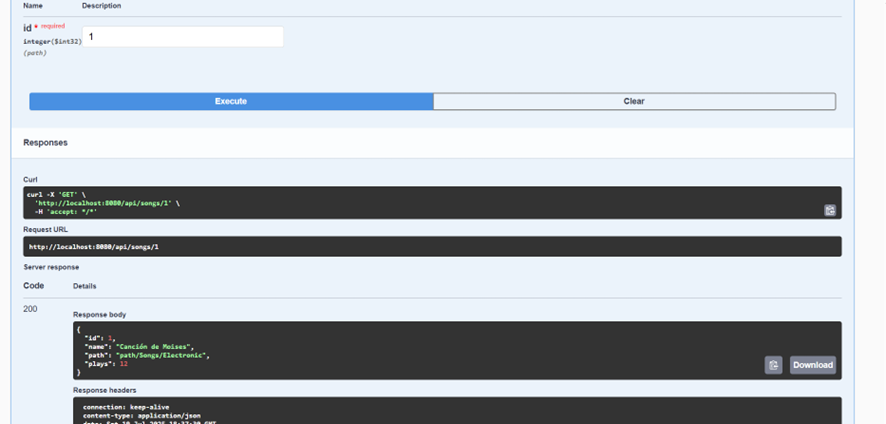

# SongApi

## Objetivo
El objetivo de este proyecto es validar los conocimientos adquiridos para desarrollar un microservicio que realice operaciones CRUD sobre una tabla de canciones, utilizando Java Spring Boot y SQL Server, y su despliegue mediante contenedores Docker.

## Configuración inicial
- **Lenguaje:** Java 17
- **Framework:** Spring Boot, Spring Web, Spring Data JPA
- **Base de datos:** SQL Server 2022 (en contenedor Docker)
- **Documentación interactiva:** Swagger UI (springdoc-openapi)
- **Contenedores:** Docker y Docker Compose

## Clonar el repositorio

```sh
git clone https://github.com/WooshC/API-SONG-AREQUIPA.git
cd API-SONG-AREQUIPA
```

## Despliegue con Docker

1. **Levantar los servicios:**
   - Ejecuta:
     ```sh
     docker-compose up --build -d
     ```
   - Esto levantará SQL Server en el puerto 14490 y SongApi en el puerto 8080.
   - El script de inicialización de la base de datos se ejecuta automáticamente al iniciar el contenedor.

2. **Verifica el estado:**
   - Puedes ver los logs con:
     ```sh
     docker logs sqlserver_songapi
     docker logs <nombre_del_contenedor_db-init>
     docker logs <nombre_del_contenedor_songapi>
     ```

## Probar la API
- Accede a la documentación y pruebas interactivas en:
  - [http://localhost:8080/swagger-ui.html](http://localhost:8080/swagger-ui.html)
- O prueba los endpoints manualmente en Postman, Insomnia o curl:

| Método | Endpoint           | Descripción                |
|--------|--------------------|----------------------------|
| GET    | /api/songs         | Obtener todas las canciones|
| GET    | /api/songs/{id}    | Obtener una canción por ID |
| POST   | /api/songs         | Crear una nueva canción    |
| PUT    | /api/songs/{id}    | Actualizar una canción     |
| DELETE | /api/songs/{id}    | Eliminar una canción       |

### Ejemplo de body para POST/PUT
```json
{
  "name": "Nueva Canción",
  "path": "/ruta/cancion.mp3",
  "plays": 0
}
```

## Pruebas del microservicio
Una vez publicado el microservicio, realiza pruebas utilizando Postman, Insomnia o la herramienta de tu preferencia. Captura pantallas de las pruebas exitosas que demuestren el correcto funcionamiento de los siguientes endpoints:
- **GET** - Consulta de canciones
- **POST** - Crear canciones
- **PUT**/**PATCH** - Actualizar una canción
- **DELETE** - Eliminar una canción

Las capturas deben mostrar la URL del endpoint, el método HTTP, el body de la petición (cuando aplique) y la respuesta exitosa (código de estado 200, 201, etc.).

## Documentación técnica
1. **Configuración inicial:** Herramientas, lenguajes, bibliotecas y frameworks utilizados.
2. **Desarrollo:**
   - Explicación del código fuente paso a paso.
   - Capturas de pantalla y comandos clave utilizados.
3. **Pruebas funcionales:** Demuestra el funcionamiento local de las operaciones CRUD mediante herramientas como Postman o Insomnia.
4. **Despliegue:**
   - Explicación de cómo se realizó el despliegue (contenedorizado o en la nube).
   - Incluye capturas de pantalla del microservicio en funcionamiento en el entorno de despliegue.

## Publicar en Docker Hub

1. **Inicia sesión en Docker Hub:**
   ```sh
   docker login
   ```
2. **Construye la imagen:**
   ```sh
   docker build -t <tu_usuario>/songapi:latest .
   ```
3. **Sube la imagen a Docker Hub:**
   ```sh
   docker push <tu_usuario>/songapi:latest
   ```
4. **(Opcional) Usa la imagen en la nube:**
   - Puedes usar la imagen publicada en Docker Hub para desplegar en Azure, AWS, GCP, etc.

---

**Autor:** Moises Arequipa

---
# Documentación Técnica

## 1. Configuración inicial

### Herramientas, lenguajes, bibliotecas y frameworks utilizados

- **Lenguaje de programación:** Java 17
- **Framework principal:** Spring Boot
- **Bibliotecas:**
  - Spring Web
  - Spring Data JPA
  - Driver JDBC para SQL Server
  - Springdoc OpenAPI (Swagger UI)
- **Contenedores:** Docker y Docker Compose
- **Base de datos:** SQL Server 2022 (en contenedor Docker)
- **Herramientas adicionales:**
  - Postman/Insomnia (para pruebas manuales)
  - IDE: Eclipse, IntelliJ IDEA o VS Code

## 2. Desarrollo
### Código fuente principal

#### Clase principal de la aplicación
```java
package com.example.songapi;

import org.springframework.boot.SpringApplication;
import org.springframework.boot.autoconfigure.SpringBootApplication;

@SpringBootApplication
public class SongApiApplication {
    public static void main(String[] args) {
        SpringApplication.run(SongApiApplication.class, args);
    }
}
```

#### Entidad Song
```java
package com.example.songapi.model;

import jakarta.persistence.*;

@Entity
@Table(name = "TBL_SONG")
public class Song {
    @Id
    @GeneratedValue(strategy = GenerationType.IDENTITY)
    @Column(name = "ID_SONG")
    private Integer id;

    @Column(name = "SONG_NAME", nullable = false)
    private String name;

    @Column(name = "SONG_PATH", nullable = false)
    private String path;

    @Column(name = "PLAYS")
    private Integer plays;

    // Getters y setters...
}
```

#### Repositorio
```java
package com.example.songapi.repository;

import com.example.songapi.model.Song;
import org.springframework.data.jpa.repository.JpaRepository;

public interface SongRepository extends JpaRepository<Song, Integer> {}
```

#### Servicio
```java
package com.example.songapi.service;

import com.example.songapi.model.Song;
import com.example.songapi.repository.SongRepository;
import org.springframework.stereotype.Service;

import java.util.List;
import java.util.Optional;

@Service
public class SongService {
    private final SongRepository repository;

    public SongService(SongRepository repository) {
        this.repository = repository;
    }

    public List<Song> findAll() { return repository.findAll(); }
    public Optional<Song> findById(Integer id) { return repository.findById(id); }
    public Song save(Song song) { return repository.save(song); }
    public void deleteById(Integer id) { repository.deleteById(id); }
}
```

#### Controlador
```java
package com.example.songapi.controller;

import com.example.songapi.model.Song;
import com.example.songapi.service.SongService;
import org.springframework.http.ResponseEntity;
import org.springframework.web.bind.annotation.*;

import java.util.List;

@RestController
@RequestMapping("/api/songs")
public class SongController {
    private final SongService service;

    public SongController(SongService service) {
        this.service = service;
    }

    @GetMapping
    public List<Song> getAll() { return service.findAll(); }

    @GetMapping("/{id}")
    public ResponseEntity<Song> getById(@PathVariable Integer id) {
        return service.findById(id)
                .map(ResponseEntity::ok)
                .orElse(ResponseEntity.notFound().build());
    }

    @PostMapping
    public Song create(@RequestBody Song song) { return service.save(song); }

    @PutMapping("/{id}")
    public ResponseEntity<Song> update(@PathVariable Integer id, @RequestBody Song song) {
        return service.findById(id)
                .map(existing -> {
                    existing.setName(song.getName());
                    existing.setPath(song.getPath());
                    existing.setPlays(song.getPlays());
                    return ResponseEntity.ok(service.save(existing));
                })
                .orElse(ResponseEntity.notFound().build());
    }

    @DeleteMapping("/{id}")
    public ResponseEntity<Void> delete(@PathVariable Integer id) {
        if (service.findById(id).isPresent()) {
            service.deleteById(id);
            return ResponseEntity.noContent().build();
        }
        return ResponseEntity.notFound().build();
    }
}
```

## 3. Pruebas funcionales

A continuación se muestran ejemplos de pruebas realizadas sobre los endpoints principales del microservicio utilizando una herramienta como Postman o Insomnia. Cada prueba incluye la descripción, el método HTTP, la URL y la evidencia visual del resultado.

### Obtener canción por ID
- **Método:** GET
- **Endpoint:** `/api/songs/1`
- **Descripción:** Obtiene la información de la canción con ID 1.


### Modificar una canción
- **Método:** PUT
- **Endpoint:** `/api/songs/1`
- **Descripción:** Modifica los datos de la canción con ID 1.


#### Verificar modificación
- **Método:** GET
- **Endpoint:** `/api/songs/1`
- **Descripción:** Se consulta nuevamente la canción para verificar que los cambios fueron aplicados.



### Borrar canción por ID
- **Método:** DELETE
- **Endpoint:** `/api/songs/1`
- **Descripción:** Elimina la canción con ID 1.


### Ver lista de canciones
- **Método:** GET
- **Endpoint:** `/api/songs`
- **Descripción:** Muestra la lista de canciones, evidenciando que la canción con ID 1 fue eliminada.


### Registrar nueva canción
- **Método:** POST
- **Endpoint:** `/api/songs`
- **Descripción:** Registra una nueva canción en la base de datos.


#### Registro exitoso
- **Descripción:** Respuesta exitosa del registro de la nueva canción.


## 4. Despliegue

### Contenerización y despliegue en la nube

**a) Contenerización:**
- Se creó un `Dockerfile` multi-stage para construir y empaquetar la aplicación Java.
- Se usó `docker-compose.yml` para orquestar el microservicio y la base de datos SQL Server, incluyendo un script de inicialización automática para la base.

**b) Publicación de la imagen:**
- Se construyó la imagen Docker y se subió a Docker Hub:
  ```sh
  docker build -t <tu_usuario>/songapi:latest .
  docker push <tu_usuario>/songapi:latest
  ```

**c) Despliegue en Azure Web App for Containers:**
1. Se creó una Web App en Azure Portal, seleccionando “Contenedor Docker” como método de despliegue.
2. Se configuró el origen de la imagen como Docker Hub, indicando la imagen `<tu_usuario>/songapi:latest`.
3. Se estableció el puerto de la aplicación en 8080.
4. (Opcional) Se configuraron variables de entorno para la conexión a la base de datos si se usó una base en la nube.
5. Se revisó y creó la aplicación, obteniendo una URL pública para acceder al microservicio.

**d) Verificación:**
- Se accedió a la URL pública proporcionada por Azure y se verificó el funcionamiento de los endpoints y la documentación Swagger.

---
